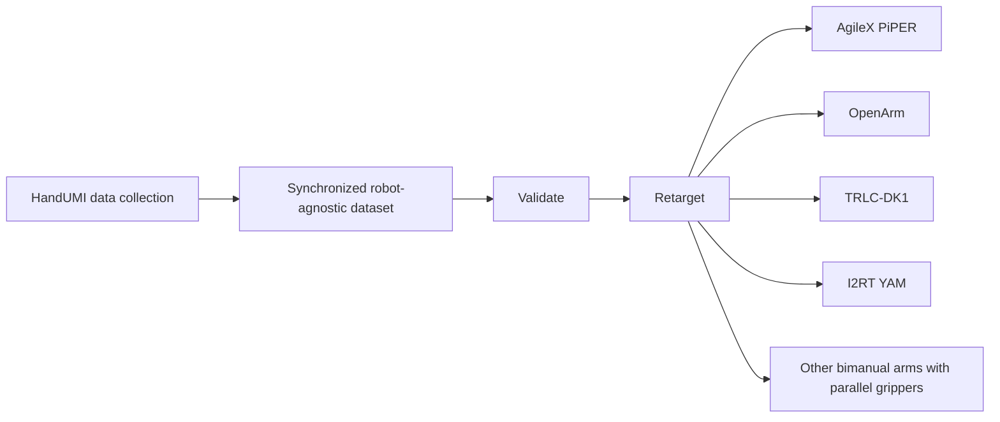
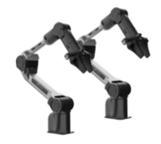
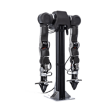
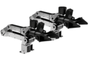
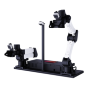

# HandUMI - Software

> **Research preview.** Full-body pose, center of mass, contact, support, and
> profile-constrained skeleton outputs are experimental platform/model
> estimates. They have not passed the repository's ground-truth validation
> gates and must not be described as anatomically accurate,
> synchronization-grade, or production-safety signals.

<p align="center">
  <a href="LICENSE"></a>
  <a href="https://github.com/BrikHMP18/HandUMI"></a>
  <a href="https://robonet-ai.github.io/handumi-sw/"></a>
</p>

[HandUMI](https://github.com/BrikHMP18/HandUMI) is a hand-worn interface for collecting robot-free bimanual demonstrations. This repository contains its synchronized data collection, calibration, validation, replay, teleoperation, and robot-retargeting software.

> **Collect once, retarget to many robots.** Record demonstrations with HandUMI
> once, then retarget and reuse the same data across different bimanual arms
> with parallel grippers, without recollecting demonstrations for each robot.

## Documentation

**[Read the HandUMI documentation](https://robonet-ai.github.io/handumi-sw/)**

- [Installation](docs/source/getting_started/installation.md)
- [Setup and calibration](docs/source/setup.md)
- [Teleoperation](docs/source/teleoperation.md)
- [Record demonstrations](docs/source/record.md)
- [Quality assurance](docs/source/workflows/datasets.md)
- [Body and trajectory visualization](docs/source/workflows/visualization.md)
- [Troubleshooting](docs/source/troubleshooting.md)
- [Research-preview release checklist](docs/source/development/release_checklist.md)
- [Add a new robot embodiment](docs/source/development/new_embodiment.md)

## Quick Start

Requires [uv](https://docs.astral.sh/uv/) and Python 3.12 or newer.

```bash
git clone https://github.com/robonet-ai/handumi-sw.git
cd handumi-sw
bash install.sh
source .venv/bin/activate
handumi-record --help
```

PICO support is installed by default. Use `bash install.sh --skip-xrt` for a Meta Quest-only workstation.

## Core Workflow



Raw captures remain robot-agnostic. After collecting data with HandUMI, the same
demonstrations can be retargeted to different bimanual arms with parallel
grippers. Robot configuration and physical controller-to-TCP calibration are
fingerprinted in dataset metadata so later conversion remains reproducible.

## Supported Bimanual Embodiments

HandUMI is optimized for fixed-base bimanual manipulators equipped with
parallel-jaw grippers. Demonstrations remain robot-agnostic, so support for new
embodiments can be added without changing the capture format.

| Bimanual | Repository | Preview |
|---|---|---|
| AgileX PiPER | [Repository](https://github.com/agilexrobotics/piper_ros) |  |
| OpenArm | [Repository](https://github.com/enactic/openarm) |  |
| TRLC-DK1 | [Repository](https://github.com/robot-learning-co/trlc-dk1) |  |
| I2RT YAM | [Repository](https://github.com/i2rt-robotics/i2rt) |  |

**More embodiments coming soon.** See
[Add a new robot embodiment](https://robonet-ai.github.io/handumi-sw/development/new_embodiment.html)
to contribute an integration. If you want support for a specific bimanual arm,
[open an embodiment request](https://github.com/robonet-ai/handumi-sw/issues/new).

## Supported Scope

- Tracking: PICO through XRoboToolkit and Meta Quest through
  [HandUMI Quest App](https://github.com/robonet-ai/handumi-quest-app).
- Robot models and simulation: AgileX PiPER, OpenArm, TRLC-DK1, Axol, and I2RT YAM.
- Real-robot teleoperation: AgileX PiPER and OpenArm through optional backends.
- Dataset format: LeRobot-compatible synchronized captures.

## Safety

This is research software. Preview and independently validate trajectories
before commanding physical robots, keep an emergency stop accessible, and
enforce the robot's joint, velocity, acceleration, workspace, and collision
limits. Do not use estimated body balance/contact state as a human-safety or
robot-safety interlock. Headset camera and motion captures can identify people
and environments; obtain consent and review datasets before sharing them.

## Credits

HandUMI builds on UMI, HandUMI Quest App, XRoboToolkit, LeRobot, PyRoki,
Viser, Rerun, and MuJoCo. See the [documentation](https://robonet-ai.github.io/handumi-sw/)
and [LICENSE](LICENSE) for attribution and third-party licensing details.

Project lead and original hardware design: [BrikHMP18](https://github.com/BrikHMP18). Core software contributors include [Leonardo Pérez](https://github.com/leoperezz), [Raul Bastidas](https://github.com/RAUL-BASTIDAS), [Mitshell Ramos](https://github.com/mbrq13), and [Alvaro Mendoza-Li](https://github.com/alvax64).

## License

Original HandUMI software and documentation are licensed under the [Apache License 2.0](LICENSE). Dataset, hardware, headset application, robot firmware, and trademark licenses remain separate.
